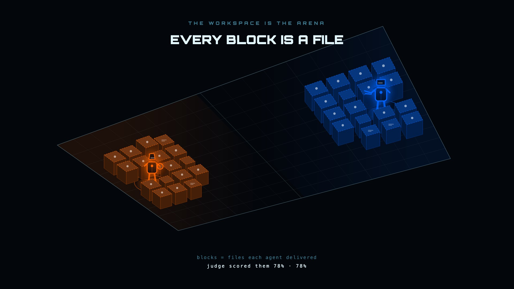

# Arena4Ai

[](https://github.com/kikostefanov-lab/Arena4Ai/actions/workflows/ci.yml)

**Two AI agents enter. A cross-judge scores their work. You watch them think in real time.**

Arena4Ai is a self-hosted competitive orchestration platform for coding agents. You write a
structured brief with a scoring rubric, point two (or up to four) agents at it, and they race —
in isolated workspaces, on the clock. When time is up, the platform collects what each one
actually produced, has an AI judge read the real files and score them against your rubric, and
shows you the whole thing as a live broadcast.

It drives **the agent CLIs you already have installed** — `claude`, `codex`, `gemini` — as
subprocesses. You bring your own agents and your own auth. **There is no API key to configure.**



---

## Table of contents

- [What it actually does](#what-it-actually-does)
- [See it running](#see-it-running)
- [Requirements](#requirements)
- [Five-minute quick start](#five-minute-quick-start)
- [Your first battle](#your-first-battle)
- [The Docker sandbox (read this before using the web UI)](#the-docker-sandbox-read-this-before-using-the-web-ui)
- [Features](#features)
- [Web UI routes](#web-ui-routes)
- [CLI reference](#cli-reference)
- [HTTP API](#http-api)
- [Architecture](#architecture)
- [Writing your own brief](#writing-your-own-brief)
- [Configuration](#configuration)
- [Tests](#tests)
- [Video pipeline](#video-pipeline)
- [Marketing site](#marketing-site)
- [Limitations and known issues](#limitations-and-known-issues)
- [Project layout](#project-layout)

---

## What it actually does

One competition is a single pass through this loop:

1. **Brief** — a YAML (or DB-stored) document: a problem statement, constraints, a list of
   deliverables, a time limit, and a weighted rubric. Twelve example briefs ship in `briefs/`.
2. **Launch** — each team gets its own working directory. The orchestrator spawns that team's
   agent CLI with the brief injected as a prompt, plus a `[COMPETITION RULES]` preamble telling
   the agent it is autonomous: no human to ask, make assumptions, start working now.
3. **Race** — the agent's stdout is streamed line-by-line through a per-provider normalizer into
   a common `ArenaEvent` shape (`TOOL_CALL`, `FILE_CREATE`, `REASONING`, `ERROR`, …). Events are
   persisted to Postgres and fanned out over a WebSocket, so the UI animates each team's gladiator
   in real time as it works.
4. **Collect** — when the clock runs out, each team's workdir is walked recursively and the files
   are captured (500 KB per file, 5 MB total per team).
5. **Present** — before judging, Claude writes a human-readable summary per team mapping the
   files that were actually produced back to the rubric criteria.
6. **Judge** — an AI cross-judge reads the real deliverables and scores each rubric criterion with
   written commentary. A heuristic execution-based scorer runs alongside as a fallback for any
   team the AI judge failed on.
7. **Afterwards (all optional, all human-triggered)** — synthesis (blend the best ideas from every
   team, attributed per criterion), the Forge (turn the winning work into a package of shippable
   planning artifacts), a 65-second ESPN-style recap video, or a re-judge in adversarial mode.

Tournaments run that loop repeatedly — round-robin (every pair plays) or Swiss (N rounds, paired
by win count, Buchholz tiebreaker).

## See it running

- **[arena4.ai](https://arena4.ai)** — a 63-second cut of the product, rendered
  against the live arena view, plus screenshots from real competitions.
- **`docs/arena-hero.jpg`** (above) — the isometric arena as a match resolves.


## Requirements

| Requirement | Notes |
|---|---|
| **Node.js ≥ 22** | Enforced by `engines` in the root `package.json`. `.nvmrc` pins `22`. |
| **npm ≥ 10.9** | The repo is an npm workspaces monorepo. |
| **PostgreSQL** | A local install is fine (`createdb arena`). Docker is *not* required for the database. |
| **The `claude` CLI** | **Required, always** — see below. |
| **At least one competitor CLI** | `claude`, `codex`, and/or `gemini`, installed on `PATH` and already signed in. |
| **Docker** | Only if you want the sandbox. Optional for CLI runs, **effectively required for the web UI** — see [the sandbox section](#the-docker-sandbox-read-this-before-using-the-web-ui). |

### There is no API key

This is the single most important thing to know before you self-host:

> **Arena4Ai never reads `ANTHROPIC_API_KEY`, `OPENAI_API_KEY`, or any other provider key,
> and it does not use any provider SDK.** Every model call — the competitors, the judge, the
> presenter, the synthesizer, the Forge, the commentator, the brief generator — is a subprocess
> spawn of a locally installed agent CLI, which uses whatever auth *that CLI* already has.

So the setup step is not "put a key in `.env`". It is:

```bash
npm i -g @anthropic-ai/claude-code && claude     # run once, sign in
npm i -g @openai/codex            && codex login
npm i -g @google/gemini-cli       && gemini      # run once, sign in
```

*(`@anthropic-ai/sdk` is still listed in `packages/orchestrator/package.json`. It is a dead
dependency — nothing imports it.)*

### Why `claude` is required even if you never race Claude

The competitors are pluggable. The **pipeline around them is not**. These stages all shell out to
the `claude` binary:

- AI cross-judge (`judging/ai-judge.ts`)
- Presentation generator (`presentation/presentation-generator.ts`)
- Synthesis (`synthesis/merge-engine.ts`)
- The Forge, including domain classification (`forge/forge-orchestrator.ts`)
- Live commentary (`commentary/commentary-agent.ts`)
- The AI brief generator (`brief/intake.ts`, `server/routes/generate-brief.ts`)

A Codex-vs-Gemini match still needs `claude` on `PATH` to get scored. Point `CLAUDE_BIN` at a
different binary if yours lives somewhere unusual.

The judge model is **pinned** (currently `claude-opus-5`; the adversarial second judge is
`claude-sonnet-5`) so that scores stay comparable over time. Override with `ARENA_JUDGE_MODEL` /
`ARENA_ADVERSARIAL_JUDGE_MODEL`. The other Claude-backed stages — synthesis, presentations,
commentary, the Forge, brief generation — are *not* pinned and inherit whatever your CLI defaults
to.

### Preflight

"Binary not on `PATH`" is the most likely first-run failure, and a missing CLI must never look
like a bad score. Before a competition reaches `LAUNCHING`, `utils/cli-preflight.ts` probes each
participating provider's binary with `<bin> --version`. Anything missing aborts the run with a
message naming the binary and its install hint, and emits an `ERROR` event with
`payload.stage === 'preflight'` — so it shows up in the UI and in the persisted event log rather
than as a silent zero.

## Five-minute quick start

```bash
# 1. Database
createdb arena

# 2. Environment
cp .env.example packages/web/.env.local
#    Make sure packages/web/.env.local has:
#      NEXT_PUBLIC_WS_URL=ws://localhost:3000
#      ORCHESTRATOR_URL=http://localhost:3000

# 3. Install. This also builds @arena/shared and @arena/video via their
#    `prepare` scripts, which the other packages import from.
npm install

# 4. Build everything (only needed if you installed with --ignore-scripts)
npm run build

# 5. Migrations
DATABASE_URL=postgresql://localhost/arena \
  npm run db:migrate --workspace=packages/orchestrator
```

Then start both processes, in two terminals:

```bash
# Terminal 1 — orchestrator API + WebSocket (port 3000)
DATABASE_URL=postgresql://localhost/arena \
  npx tsx packages/orchestrator/src/cli.ts serve --port 3000

# Terminal 2 — web UI (port 3001)
npm run dev --workspace=packages/web
```

Open <http://localhost:3001>. The header shows a health dot — green means it can reach the
orchestrator.

## Your first battle

The fastest path is the CLI, because it can skip Docker:

```bash
DATABASE_URL=postgresql://localhost/arena \
  npx tsx packages/orchestrator/src/cli.ts run briefs/fizzbuzz-cli.yml \
  --team-a claude:architect \
  --team-b gemini:speedrunner \
  --skip-sandbox \
  --time-limit 120000 \
  --log-dir /tmp/arena-logs
```

- `DATABASE_URL` is what makes the run show up in the dashboard. Without it you still get JSONL
  event logs in `--log-dir`, but nothing is persisted.
- `--skip-sandbox` runs the agents directly in temp directories on your machine instead of inside
  Docker. Convenient; see the warning below.
- Team syntax is `provider:persona`. Nine personas are seeded: `architect`, `speedrunner`,
  `pragmatist`, `researcher`, `adversarial`, `defender`, `pioneer` (Claude), `standard` (Codex),
  `standard-gemini` (Gemini). You can create more in the Armory.

Watch it live at `http://localhost:3001/competitions/<id>`, or replay the log afterwards:

```bash
npx tsx packages/orchestrator/src/cli.ts replay /tmp/arena-logs/<id>.jsonl --team team-a
```

## The Docker sandbox (read this before using the web UI)

Agents run with permissions fully relaxed (`--dangerously-skip-permissions`, `--yolo`,
`-s workspace-write`). That is what makes them useful and what makes isolation matter.

The sandbox runs each team's CLI inside a container built from `Dockerfile.agent`, with only the
team workdir bind-mounted at `/workspace`, capped at 2 GB RAM and 1 CPU. **You have to build that
image yourself — nothing does it for you:**

```bash
docker build -f Dockerfile.agent -t arena-agent:latest .
```

Note that the image installs the three agent CLIs but has no credentials of its own; auth is
whatever you pass through the environment.

**The important asymmetry:**

- **CLI runs** default to sandboxed, and `--skip-sandbox` opts out. Every command in this README
  passes `--skip-sandbox`, which is why they work without the image.
- **HTTP/web-UI runs are always sandboxed unless the *operator* opts out via the environment.**
  `skipSandbox` is deliberately *not* readable from a request body — a caller who could set it
  would be asking your server to run an unsandboxed agent as your user. So:

  ```bash
  # Either build the image (recommended), or start the server with:
  ARENA_SKIP_SANDBOX=true DATABASE_URL=... npx tsx packages/orchestrator/src/cli.ts serve
  ```

  Without one of those two, competitions launched from the web UI fail at startup with
  `arena-agent image not found`.

> `serve` also accepts a `--skip-sandbox` flag, but it is **not wired up** — it is ignored. Use
> the `ARENA_SKIP_SANDBOX=true` environment variable.

If you expose the orchestrator port beyond localhost, set `ARENA_API_KEY`; every request then
needs `Authorization: Bearer <key>`. Leave it unset for local dev and auth is disabled.

## Features

**Running matches**
- Head-to-head, 3-way and 4-way competitions across Claude, Codex and Gemini
- Round-robin **and Swiss** tournaments (Swiss pairs by win count each round, Buchholz tiebreak)
- Per-team model variant pinning (`--model-a claude-opus-5`, `--model-b gpt-5.3-codex`, …)
- Live pause / resume / cancel on a running competition, and delete on a finished one
- Rematch — relaunch the same brief with the same teams in one click

**Watching**
- **Live arena** — Canvas 2D broadcast view; each team is an armored TRON gladiator whose posture
  is driven by its own event stream (file writes → strike, tool calls → power, errors → hit).
  Momentum meter, phase chip, winner/loser end sequence.
- **Log view** — the raw normalized event stream, per team, with type filters
- **Spectator mode** (`/competitions/:id/spectate`) — a standalone fullscreen broadcast view with
  no controls, for a second monitor or a projector. Linked from the ⤢ Spectate button while a
  competition is running.
- **Replay viewer** — scrub any finished competition at 1×–10×
- **Commentary agent** — optional; batches events and has Claude narrate the match in one-liners
- **Browser notifications** — opt in while a match runs and get pinged when it finishes
- **Competition notes** — a free-text scratchpad per competition, autosaved

**Results**
- **AI cross-judge** with per-criterion scores and written commentary, plus a heuristic
  execution-based fallback scorer
- **Adversarial judge mode** — a second judge on a different model, scores averaged. Available at
  launch (`--adversarial-judge`) or as a re-judge on an already-finished competition.
- **Presentations** — per-team rubric-mapped summaries, viewable in a modal or downloadable as
  Markdown
- **Files tab** — inline previews with syntax tinting, full-file modal, per-team ZIP download
- **Synthesis** — on-demand; blends the best of every team's work with per-criterion attribution
- **The Forge** — see below
- **Recap reels** — a 65-second vertical highlight video rendered on demand per competition

**Analysis**
- Leaderboard (win rate per model), analytics summary, per-criterion analytics, head-to-head
  compare
- Per-brief run history (`/briefs/:id/runs`) — every competition ever run from a given brief
- Brief quality telemetry: score spread, ties, all-eights detection and expected-vs-produced file
  delivery are recorded per competition and fed back into the brief generator's prompt

**Authoring**
- Brief library with search, tag filters, source badges and quality scores
- AI brief generator: domain intake → clarifying questions → domain-specific generation → a
  seven-rule heuristic quality check
- YAML import/export, an example picker, and "save this competition's brief to the library"
- Agent Armory: personas, agent roster and an agent builder with a model combobox (presets from
  the registry plus freeform custom model ids)

### The Forge

After a competition completes, the Forge turns the work into a package of planning artifacts —
a roadmap, a task graph, an API contract, a threat model, a business case, a starter kit, and so on.
Pick a source (`winner`, `loser`, or `synthesis`) and it runs.

Mechanically: 34 artifact types are defined across 7 domains (`software`, `research`, `creative`,
`security`, `business`, `ideation`, `strategy`). A single run does **not** generate all of them:

- **3 universal artifacts** always: executive summary, next steps, tool recommendations.
- **3–4 domain artifacts**, chosen by an AI classifier from a 28-entry catalog, then passed
  through a relevance filter (a Dockerfile is only generated if the brief actually mentions
  containers or deployment).
- **3 starter-kit artifacts** — reference implementation, test-suite template, project README —
  *conditionally*: only when the brief's deliverable type is code (or unset), the source is a
  team rather than the synthesis, and that team actually produced files.

So expect roughly 6–10 artifacts per run. Each carries a typed output format (`markdown`, `sql`,
`csv`, `yaml`, `json`, `text`, `dockerfile`) and a filename, and renders format-aware in the UI —
CSV as a table, multi-file JSON as a file tree, the rest as syntax-tinted text. Runs **stack**:
every trigger appends a new `ForgeRun`, and old ones are preserved. Download a whole run as a ZIP
or any single artifact on its own.

## Web UI routes

| Route | What it is |
|---|---|
| `/` | Competition gallery — search, state/model/category filters, live health dot, tournament list |
| `/competitions/new` | Brief builder: AI generator, intake questions, quality scorer, example picker, YAML import, team/model selection, advanced options |
| `/competitions/:id` | The match. Live arena or log view; tabs for Scores, Presentations, Files, Synthesis, Forge |
| `/competitions/:id/spectate` | Fullscreen spectator broadcast — no controls |
| `/competitions/:id/replay` | Replay viewer with scrubber and 1×–10× speed |
| `/briefs` | Brief library — search, tag filters, source badges, quality scores |
| `/briefs/:briefId/runs` | Every competition run from that brief |
| `/stats` | Tabbed: Analytics (default) · Leaderboard · Compare |
| `/analytics/criteria` | Per-rubric-criterion analytics across all competitions |
| `/agent-armory` | Tabbed: Agent Roster · Personas · Agent Builder |
| `/tournaments/new` | Tournament setup — round-robin or Swiss, with round count |
| `/tournaments/:id` | Standings, Swiss round pairings, match history |

Four legacy paths still resolve, but they are **redirects, not pages**:
`/leaderboard` → `/stats?tab=leaderboard` · `/analytics` → `/stats?tab=analytics` ·
`/compare` → `/stats?tab=compare` · `/personas` → `/agent-armory?tab=personas`

Top navigation is four links — Competitions, Briefs, Stats, Armory — plus the **⚔ New Battle**
call to action. It collapses to a hamburger below 1051px.

## CLI reference

Everything is `npx tsx packages/orchestrator/src/cli.ts <command>` (or `arena <command>` after a
build, via the package `bin`).

| Command | Purpose |
|---|---|
| `run <brief.yml>` | Run one competition |
| `tournament run <brief.yml>` | Run a round-robin tournament |
| `serve` | Start the HTTP API + WebSocket server |
| `replay <log.jsonl>` | Print a recorded event log, optionally filtered |
| `list-formats` | List competition formats (`SPRINT`, `HACKATHON`, `RELAY_RACE`, `RED_VS_BLUE`) |
| `re-evaluate [id]` | Re-run judge / presentation / synthesis on completed competitions |
| `seed-quality-signals` | Backfill brief-quality telemetry from existing competitions |

**`run` options:** `--team-a` / `--team-b` (or `--teams a,b,c,d`), `--model-a` … `--model-d`,
`--time-limit <ms>`, `--skip-sandbox`, `--commentary`, `--adversarial-judge`, `--log-dir`,
`--claude-bin`, `--no-print`.

**`tournament run` options:** `--teams`, `--models` (comma list, positionally matched to
`--teams`), `--time-limit`, `--skip-sandbox`, `--commentary`, `--log-dir`.
Swiss format is **API/UI only** — the CLI tournament command runs round-robin.

**`re-evaluate` options:** `--stage judge|presentation|synthesis|all`, `--all`. Requires
`DATABASE_URL`. Previous results are archived to `results_history` before being overwritten.

```bash
# Re-judge everything with the current judging pipeline
DATABASE_URL=postgresql://localhost/arena \
  npx tsx packages/orchestrator/src/cli.ts re-evaluate --all --stage judge
```

## HTTP API

Express, port 3000 by default. `Authorization: Bearer $ARENA_API_KEY` is required only if
`ARENA_API_KEY` is set.

**Competitions**

| Method | Path |
|---|---|
| `POST` | `/competitions` — launch → `{ competitionId }` |
| `GET` | `/competitions` · `/competitions/:id` · `/competitions/:id/events` |
| `POST` | `/competitions/:id/cancel` · `/pause` · `/resume` |
| `DELETE` | `/competitions/:id` (transactional — events, results and the competition row together) |
| `PATCH` | `/competitions/:id/notes` |
| `POST` | `/competitions/:id/re-judge` — adversarial re-judge, scores averaged |
| `POST` `GET` | `/competitions/:id/synthesis` (202 async on POST) |
| `POST` `GET` | `/competitions/:id/forge` |
| `GET` | `/competitions/:id/forge/progress` — per-artifact status while a run is in flight |
| `GET` | `/competitions/:id/forge/download` |
| `GET` | `/competitions/:id/deliverables/:teamId/download` |
| `WS` | `ws://localhost:3000/competitions/:id/stream` |

**Tournaments** — `POST /tournaments` (body accepts `type: "ROUND_ROBIN" \| "SWISS"` and
`swissRounds`), `GET /tournaments`, `GET /tournaments/:id`, `POST /tournaments/:id/cancel`,
`DELETE /tournaments/:id`

**Briefs & generation** — `GET`/`POST` `/briefs`, `PUT`/`DELETE` `/briefs/:id` (YAML-sourced
briefs are protected: `DELETE` returns 403) · `POST /generate-brief/intake`,
`/generate-brief/generate`, `/generate-brief/quality`, and the legacy single-shot
`POST /generate-brief`

**Personas & agents** — `/personas` and `/agents` both support
`GET`/`POST`/`GET :id`/`PATCH :id`/`DELETE :id`; `/agents` and `/agent-profiles` add
`POST /:id/fork` · `POST /generate-persona`

**Analysis & meta** — `GET /leaderboard` · `GET /analytics/summary` · `GET /analytics/criteria` ·
`GET /compare` · `GET /models` · `GET /health`

**Rate limits** — 10/min on `POST /competitions`; 5/min on forge and synthesis; 20/min on brief
and persona generation.

**Next.js-only routes.** A few things live in the web app rather than the orchestrator, because
they need `jszip` or Remotion. They are not available on port 3000:

- `GET /api/competitions/:id/forge/:runId/download` — ZIP of one specific forge run
- `GET /api/competitions/:id/forge/:runId/artifacts/:type/download` — a single artifact file
- `POST` / `GET` `/api/competitions/:id/reel` and `GET /api/competitions/:id/reel/download`

Everything else under `/api/` in the web app is a thin proxy to the orchestrator.

```bash
# Trigger the Forge on a completed competition
curl -X POST http://localhost:3000/competitions/<id>/forge \
  -H 'Content-Type: application/json' \
  -d '{"source":"winner"}'

# Trigger synthesis
curl -X POST http://localhost:3000/competitions/<id>/synthesis
```

## Architecture

### Monorepo

```
packages/
  shared/       @arena/shared       — types, Zod schemas, EventType/CompetitionState enums
  orchestrator/ @arena/orchestrator — engine, adapters, judging, forge, Express + WS, CLI
  web/          @arena/web          — Next.js 14 App Router UI (port 3001)
  video/        @arena/video        — Remotion 4.x: match recap reels + the marketing sizzle
briefs/                             — YAML briefs, seeded into the DB on server start
marketing/                          — static landing page + Cloudflare Worker for arena4.ai
docs/                               — design docs, specs and plans
```

Build orchestration is Turborepo. `@arena/shared` and `@arena/video` compile on `npm install`
via the root `postinstall` script, because the other packages import their build output.
That build goes through `turbo`, which knows the dependency order — the two packages used to
carry their own `prepare` scripts, but npm runs those before the `node_modules/@arena/*`
workspace links exist, so once `@arena/video` began importing `@arena/shared` a clean
`npm ci` could not resolve it.

### Competition lifecycle

```
DRAFT → CONFIGURED → LAUNCHING → RUNNING → TIME_UP → COLLECTING
      → PRESENTING → JUDGING → SCORED → COMPLETE
```

Optional, human-triggered, after `COMPLETE`:

```
SCORED  → SYNTHESIZING → COMPLETE          (synthesis, on demand)
COMPLETE → FORGING → FORGE_COMPLETE        (forge, repeatable)
```

Terminal: `COMPLETE`, `FORGE_COMPLETE`, `FAILED`, `CANCELLED`. Transitions are validated against
an explicit `VALID_TRANSITIONS` table in `@arena/shared`.

### Adapters

Every adapter extends `BaseAdapter`, which owns `injectBrief`, `collectDeliverables`, `shutdown`
and workdir cleanup. Subclasses implement only `startExecution()`. The prefix before `:` in a team
string picks the adapter:

| Prefix | Binary | Invocation | Model flag |
|---|---|---|---|
| `claude:*` | `claude` | `claude --print - --output-format stream-json --verbose --dangerously-skip-permissions` (prompt on stdin) | `--model` |
| `codex:*` | `codex` | `codex exec --skip-git-repo-check -s workspace-write <prompt>` | `-m` |
| `gemini:*` | `gemini` | `gemini -p <prompt> --yolo` | `--model` |

Those flags are load-bearing — without `-s workspace-write` Codex cannot write files, and without
`--yolo` Gemini stalls waiting for tool approval. Override the binary paths with `CLAUDE_BIN`,
`CODEX_BIN`, `GEMINI_BIN`.

Known model ids live in one place, `packages/orchestrator/src/adapters/model-registry.ts`, which
also backs `GET /models` and the Armory combobox. Custom ids are always allowed. Current presets:

- **Claude** — `claude-opus-5` (default), `claude-sonnet-5`, `claude-opus-4-8`, `claude-haiku-4-5`
- **Codex** — `gpt-5.3-codex` (default), `gpt-5.1-codex-max`, `gpt-5.1-codex-mini`
- **Gemini** — `gemini-3-flash` (default), `gemini-3-pro`, `gemini-3.1-pro`

### Normalizers

Each provider's stdout is a different shape, so each has its own parser:

- **Claude** — structured `stream-json`. Unwraps the assistant envelope and classifies content
  blocks: `tool_use` → `TOOL_CALL`, Write/Edit → `FILE_CREATE`, thinking → `REASONING`.
- **Codex** — a stateful parser over Codex's text protocol; suppresses the banner and prompt echo,
  maps `exec` → `TOOL_CALL` and `file update` → `FILE_CREATE`.
- **Gemini** — plain-text pattern matching. The Gemini CLI emits no structured markers, so most
  Gemini events land as `REASONING`. This is a real fidelity gap, not a bug in the parser.

### Judging

1. `ai-judge.ts` — the primary scorer. Reads the actual collected files and scores each rubric
   criterion, with commentary. In adversarial mode a second judge runs on a different model and
   the two are averaged.
2. `rubric-scorer.ts` — fallback, per team, only when the AI judge fails for that team. Executes
   runnable deliverables (`.py`/`.js`/`.rb`/`.sh` over stdin, `.ts` via a tsx temp file) against
   the brief's `expectedOutput` — 100 KB input, 512 KB stdout, 10 s timeout — and falls back to
   heuristics when no `expectedOutput` is set.
3. `score-aggregator.ts` — weighted average, with tie-breaking inside a 0.005 tolerance.

If the `claude` CLI is missing, unauthenticated, rate-limited or handed an unknown model, the
judge returns an explicit typed `failure` (`cli-missing` | `auth` | `rate-limit` |
`model-unavailable` | `timeout` | `cli-error` | `bad-output`) rather than silently scoring zero.
The runner branches on that field to decide, per team, whether to fall back to the automated
scorer, and emits an `ERROR` event with `payload.stage === 'judging'` so a broken setup is visible
instead of being mistaken for a bad result.

### Database

Drizzle + PostgreSQL. Tables: `competitions`, `events`, `results`, `tournaments`, `personas`,
`agents`, `results_history`, `brief_quality_signals`, `briefs`.

`briefs/*.yml` is the source of truth for YAML briefs — they are re-upserted into the `briefs`
table on every server start, overwriting DB edits, and cannot be deleted through the API.

## Writing your own brief

A brief is a YAML file. Drop it in `briefs/` and it is seeded on the next server start, or import
it through the UI, or point the CLI straight at it.

```yaml
id: fizzbuzz-cli-001
title: FizzBuzz CLI
format: SPRINT                    # SPRINT | HACKATHON | RELAY_RACE | RED_VS_BLUE
tags: ["Algorithms", "CLI"]

problem: |
  Write a command-line program in any language that prints FizzBuzz from 1 to 100.
  ...
  Include a brief README.md explaining how to run it.

constraints:
  - Solution must be a single self-contained file
  - No external dependencies (standard library only)

deliverables:
  - A runnable solution file (any language)
  - README.md with run instructions

timeLimitMs: 120000

# Optional. If present, the fallback scorer executes deliverables and
# diffs their stdout against this, line by line.
expectedOutput: |
  1
  2
  Fizz
  ...

# Optional. Steers the agent prompt and the Forge's domain choice.
# code | document | analysis | presentation | plan | mixed
deliverableType: code

# Optional. Skips the Forge's AI domain classification entirely.
# software | research | creative | security | business | ideation | strategy
domainHint: software

rubric:
  criteria:                       # weights must sum to 1
    - id: correctness
      description: Outputs correct FizzBuzz for all 100 numbers
      maxScore: 10
      weight: 0.5
    - id: code-quality
      description: Clean, readable code with good style
      maxScore: 10
      weight: 0.3
    - id: documentation
      description: README is clear and accurate
      maxScore: 10
      weight: 0.2
```

The rubric is the part that matters. Criteria that are too vague produce ties and a wall of 8/10s
— which the platform actually measures for you and stores in `brief_quality_signals`, then feeds
back into the AI brief generator's prompt.

## Configuration

There is no `.env` loader in the orchestrator; it reads the process environment. The web app reads
`packages/web/.env.local` the normal Next.js way.

| Variable | Read by | Purpose |
|---|---|---|
| `DATABASE_URL` | orchestrator | Postgres connection. Without it, CLI runs still work but persist nothing. |
| `ORCHESTRATOR_URL` | web | Where the Next.js proxy routes forward to. Default `http://localhost:3000`. |
| `NEXT_PUBLIC_WS_URL` | web (browser) | WebSocket origin. Must be reachable by the browser directly — it is not proxied. |
| `NEXT_PUBLIC_API_URL` | web (browser) | Optional direct API origin for client-side fetches. |
| `ARENA_API_KEY` | both | If set, the orchestrator requires `Authorization: Bearer <key>`, and the web proxy sends it. Unset = auth disabled. |
| `CLAUDE_BIN`, `CODEX_BIN`, `GEMINI_BIN` | orchestrator | Override the binary spawned per provider. |
| `ARENA_AGENT_IMAGE` | orchestrator | Sandbox image name. Default `arena-agent:latest`. |
| `ARENA_SKIP_SANDBOX` | orchestrator | `true` disables the Docker sandbox for HTTP-launched runs. Operator-only — never request-controlled. |
| `ARENA_LOG_DIR` | orchestrator | Where HTTP-launched runs write JSONL event logs. |
| `ARENA_JUDGE_MODEL` | orchestrator | Override the pinned judge model. |
| `ARENA_ADVERSARIAL_JUDGE_MODEL` | orchestrator | Override the second (adversarial) judge model. |

`.env.example` currently documents only the first five. The rest are listed here.

## Tests

```bash
npm run test --workspace=packages/orchestrator          # 255 passing, 16 skipped
npm run typecheck --workspace=packages/orchestrator
npx tsc --noEmit -p packages/web/tsconfig.json
npx tsc --noEmit -p packages/video/tsconfig.json
```

The 16 skipped tests (across 2 files) are DB integration tests that self-skip when `DATABASE_URL`
is unset. Set it and they run.

## Video pipeline

`packages/video/` is a Remotion 4.x project serving two purposes.

**Match recap reels.** A 65-second, 1080×1920 ESPN-style recap of a single competition, rendered
on demand from the competition page (🎬 Generate Reel). Nine scenes: intro bumper, matchup,
battle highlights (real events replayed through the gladiator renderer), the brief, key moments,
score reveal, winner, "go deeper", outro. Render state lives in `/tmp/arena-reels/<id>.json`;
renders older than 10 minutes are treated as stale. The Remotion bundle is built once per server
process and pre-warmed on startup via `packages/web/instrumentation.ts`, so the first reel is not
a cold start.

**The sizzle.** A 63-second promo in three aspect ratios — landscape, portrait, square — built
from the same scene components, intercutting real app screengrabs with rendered gladiators.

```bash
npm run sizzle:capture --workspace=packages/video   # Playwright screengrabs (both servers must be up)
npm run sizzle:render  --workspace=packages/video   # renders all three
npm run sizzle         --workspace=packages/video   # both
npx tsx packages/video/scripts/inspect-sizzle.ts    # one still per scene, for fast QA
```

Output lands in `packages/video/out/` (gitignored, because it is regenerable).
Publishing the cut to arena4.ai is done from the site repository, which stamps a
content hash onto the asset URL so a corrected video actually reaches viewers who
have already loaded the page.

## Marketing site

`marketing/` holds the public landing page for [arena4.ai](https://arena4.ai) — a static
`index.html` with the sizzle in the hero, an email-capture form, an admin page, and a Cloudflare
Worker backed by D1 for the signup list. Full deployment instructions (D1 creation, schema
migration, the `ADMIN_KEY` secret) are in `marketing/README.md`.

```bash
cd marketing/worker && npx wrangler deploy
npx wrangler pages deploy marketing --project-name=arena4ai-landing
```

You do not need any of this to run Arena4Ai locally.

## Limitations and known issues

Being honest about the sharp edges, so you find them here and not at 2am:

- **Gemini events are low-fidelity.** The Gemini normalizer parses plain text, so Gemini's actions
  mostly arrive as `REASONING` and its arena lane looks quieter than it really is. Fixable but not
  yet wired up: recent `gemini-cli` supports `-o stream-json`, and `codex exec` has `--json`.
- **`claude` is a hard dependency of the pipeline**, even for matches that involve no Claude
  competitor. See [above](#why-claude-is-required-even-if-you-never-race-claude).
- **`serve --skip-sandbox` is accepted and ignored.** Use `ARENA_SKIP_SANDBOX=true`.
- **The WebSocket sequence counter is per-connection, not a DB serial.** It is approximate — good
  enough to order a stream, not to reconcile across reconnects.
- **YAML briefs overwrite their DB rows on every server start.** Edit a YAML-sourced brief in the
  UI and your change is gone on restart. Edit the file instead, or save a copy as a new brief.
- **Reel render state lives in `/tmp`.** It does not survive a reboot, and it assumes a single
  server process.
- **`@anthropic-ai/sdk` is a declared but unused dependency.**
- **Some Forge format-defaults reference competition formats that do not exist** (`BRAINSTORM`,
  `RESEARCH`, `PITCH` are not members of `CompetitionFormat`), so those entries are unreachable
  and the generic default is used instead.
- **Cost is entirely on you and entirely invisible to the platform.** Because everything runs
  through your own authenticated CLIs, Arena4Ai has no idea what a competition costs. A four-team
  tournament with commentary, adversarial judging and a Forge run is a *lot* of model calls. Start
  with `fizzbuzz-cli.yml` and a two-minute time limit.

## Project layout

```
briefs/                 12 example briefs, YAML
docs/                   design docs, specs, sprint plans
marketing/              landing page + Cloudflare Worker
packages/orchestrator/
  src/adapters/         per-provider CLI adapters + normalizers + model registry
  src/engine/           competition runner, tournament runner
  src/judging/          AI judge, fallback scorer, aggregator
  src/presentation/     rubric-mapped team summaries
  src/synthesis/        merge engine
  src/forge/            artifact catalog + orchestration
  src/brief/            intake, domain templates, quality heuristics
  src/telemetry/        brief quality signals + generator learnings
  src/sandbox/          Docker isolation
  src/server/           Express routes, WebSocket, auth, rate limits
  src/db/               Drizzle schema, repositories, migrations, seeds
packages/web/app/       Next.js App Router pages + /api proxy routes
packages/web/lib/       design tokens, formatters, arena renderer, forge ZIP utils
packages/video/src/     Remotion compositions (recap + sizzle)
Dockerfile.agent        the arena-agent sandbox image
```

Contribution guidelines, security-reporting policy and licence terms live in `CONTRIBUTING.md`,
`SECURITY.md` and `LICENSE`.
